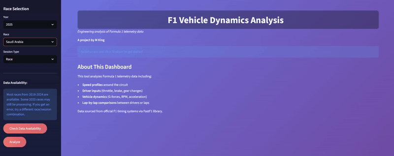
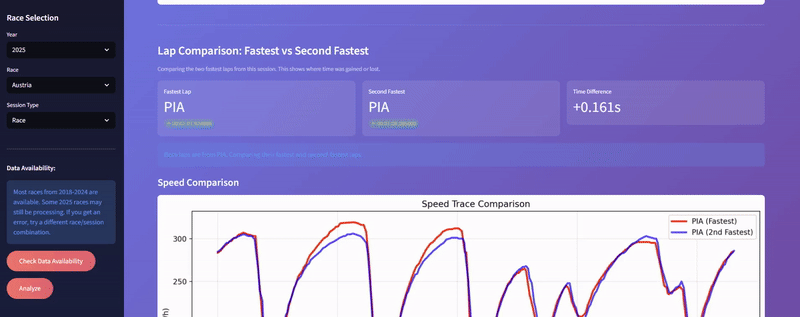

# F1 Telemetry Dashboard

**A project by M King**

An interactive web application for analyzing Formula 1 telemetry data, built with Streamlit and FastF1. This dashboard provides comprehensive insights into vehicle dynamics, driver performance, and lap-by-lap comparisons.

## Features

### Core Analysis
- **Track Visualization**: Interactive track maps with speed heatmaps showing performance across the circuit
- **Performance Metrics**: Comprehensive statistics including max/min/average speeds, RPM, G-forces, and acceleration data
- **Telemetry Plots**: Detailed graphs showing speed, throttle, brake, RPM, and gear changes throughout the lap

### Engineering Insights
- **Braking Performance**: Maximum deceleration forces, estimated braking distances, and comparison to road cars
- **Acceleration Analysis**: G-force calculations, 0-100 km/h estimates, and force experienced by drivers
- **Speed & Power**: Top speed analysis, estimated power output, and aerodynamic drag calculations
- **Corner Loading**: Speed ranges, lateral G-forces, and tire contact patch information

### Advanced Features
- **Sector Time Breakdown**: Analysis of lap time distribution across track sectors
- **DRS Usage Analysis**: Visualization of DRS zones and speed gains (when data is available)
- **Lap Comparison**: Side-by-side comparison of the fastest and second-fastest laps, including:
  - Speed trace overlays
  - Throttle and brake input comparisons
  - Statistical performance differences
  - Delta analysis showing where time is gained or lost

## Demo

### Dashboard Overview


### Track Map Visualization


### Lap Comparison


## Installation

### Prerequisites
- Python 3.8 or higher
- pip package manager

### Setup

1. Clone this repository:
```bash
git clone https://github.com/KingMatthew425/f1-telemetry-dashboard
cd f1-telemetry-dashboard
```

2. Install required packages:
```bash
pip install streamlit matplotlib fastf1
```

3. Run the application:
```bash
streamlit run app.py
```

4. Open your browser and navigate to `http://localhost:8501`

## Usage

### Selecting a Race
1. Use the sidebar to select:
   - **Year**: Choose from 2018-2025
   - **Race**: Select from the F1 calendar
   - **Session Type**: Race (R), Qualifying (Q), or Practice (FP1/FP2/FP3)

2. Click **"Check Data Availability"** to verify the selected combination has data

3. Click **"Analyze"** to load and visualize the telemetry data

### Understanding the Data

#### Performance Metrics
The dashboard displays key performance indicators including maximum speed, acceleration forces, and braking performance based on the fastest lap from the selected session.

#### Track Map
The color-coded track map shows speed variations around the circuit, with warmer colors (red) indicating higher speeds and cooler colors (blue) showing slower corners.

#### Telemetry Plots
Three synchronized plots show:
- Speed profile throughout the lap
- Throttle (green) and brake (red) inputs
- RPM (purple) and gear selection (orange)

#### Lap Comparison
Compare the fastest and second-fastest laps to see:
- Where speed differences occur
- How driver inputs differ between laps
- Which driver/lap held advantages in different sections

### Data Availability Notes

- **Most reliable data**: Races from 2020-2024
- **Brake data**: Often incomplete or binary (0/1) in the FastF1 library
- **DRS data**: Rarely available; most sessions will not have this telemetry
- **Practice sessions**: Generally have less complete data than Race and Qualifying

## Technical Details

### Data Source
Telemetry data is sourced from official F1 timing systems via the [FastF1](https://github.com/theOehrly/Fast-F1) Python library, which provides access to historical F1 data.

### Technologies Used
- **Streamlit**: Web application framework
- **FastF1**: F1 telemetry data access library
- **Matplotlib**: Data visualization and plotting
- **Python**: Core programming language

### Data Caching
The application creates a local cache directory (`f1_cache`) to store downloaded telemetry data, significantly speeding up subsequent analyses of the same races.

## Known Limitations

1. **Brake Data**: The FastF1 library provides brake data as binary (on/off) rather than percentage values, limiting the detail of brake analysis
2. **DRS Availability**: DRS telemetry is rarely available in the data feed, even for recent races
3. **Data Completeness**: Some race/session combinations may have incomplete or missing telemetry
4. **2025 Data**: Races from the current season may still be processing and unavailable

## Future Enhancements

Potential features for future development:
- Multi-driver comparison across more than 2 laps
- Tire compound and degradation analysis
- Weather condition integration
- Export functionality for reports and data
- Additional statistical analysis and correlations

## Contributing

Contributions are welcome! Please feel free to submit issues or pull requests.

## License

This project is for educational and analytical purposes. All F1 data is property of Formula 1 and is accessed through the FastF1 library under their terms of use.

## Acknowledgments

- **FastF1**: For providing access to F1 telemetry data
- **Streamlit**: For the excellent web application framework
- **Formula 1**: For the data and the sport

## Contact

**M King**

For questions, suggestions, or collaboration opportunities, please reach out via kingm425@protonmail.com

---

*Built with passion for motorsport and data analysis*
